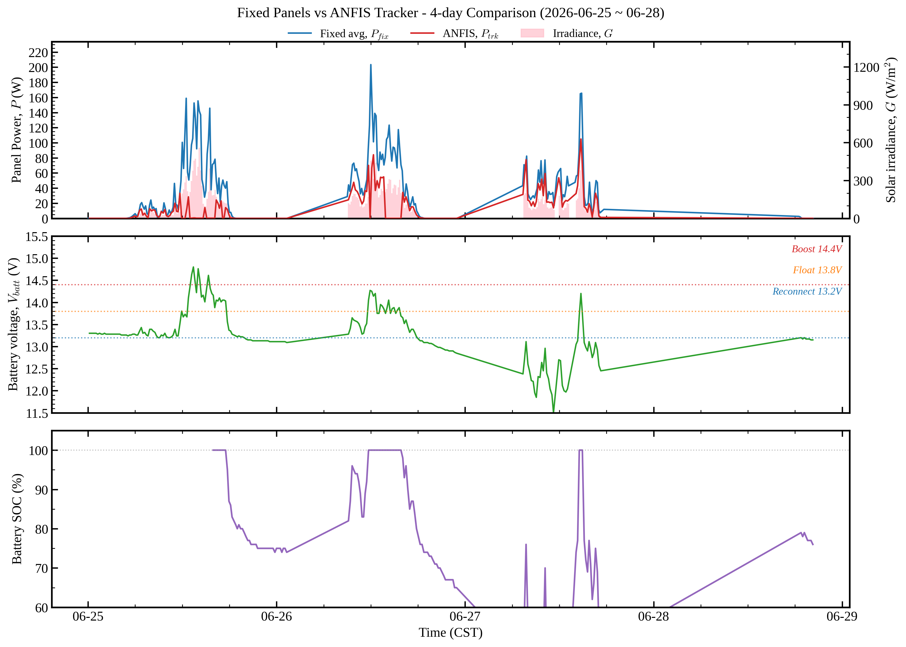

# V3 摘要:6/25-6/28 固定 vs ANFIS 追日對照分析

**日期**:2026-06-29
**資料範圍**:2026-06-25 ~ 06-28(4 天)
**資料來源**:22 片固定面板(Z3A)+ ANFIS 追日(EPEVER RS485)+ 場域照度計(PMP-TPE-TEMPLE)

---

## Slide 1:發電量、電池電壓、SOC 對照

**要點**:
- **固定面板平均 P 峰值 203 W**(藍線),**ANFIS 追日 P 峰值 105 W**(紅線)
- ANFIS 為固定面板平均的 **~52%**,但**有效追蹤形狀** — 早晚有明顯尖峰
- 場域照度 G 峰值 560 W/m²(這 4 天雲量偏多,不是強日照)
- 電池 $V_{batt}$ 在 11.5-14.8V 大幅震盪,**跨越 Boost/Float/Reconnect 3 個閾值**
- 電池 SOC 從 100% 跌至 **13%**,再回充到 100%,**真實深循環發生**

---

## Slide 2:通訊中斷驗證(3 源缺漏同步表)

**觀察**:資料有 5 個大缺口。假設 = WiFi 機小電池放空。

| ANFIS 缺漏期間 | 照度計同步缺? | 固定面板同步缺? |
|---|:---:|:---:|
| 6/26 01:17 ~ 09:09(7.9 hr)| ✅ | ✅ |
| 6/26 22:54 ~ 6/27 07:22(8.5 hr)| ✅ | ✅ |
| 6/27 13:01 ~ 14:07(1.1 hr)| ✅ | ✅ |
| **6/27 17:16 ~ 6/28 18:45(25.5 hr)** | ✅ | ✅ |

**結論**:3 個獨立資料源缺漏完全同步 → **證實** WiFi 機供電問題,非設備故障。

**模式**:傍晚 17-20 時斷 → 凌晨連續斷 → 晨間 07-09 時復原。**與小 PV 日照週期完美對應**。

---

## Slide 3:大電池深循環原因

**新架構發現**:大電池非孤立儲能,**持續下送電力至下方總控制室**。

**負載估算**:
- 6/26 14:00 SOC 100% → 6/27 11:15 SOC 13%
- 放電 87% × 2400 Wh ≈ **2088 Wh** in 21.25 hr
- 平均下游負載 **≈ 98 W**(常駐)

**意義**:
- 大電池會被下游持續拉低 → SOC 深循環是正常現象
- **對 ANFIS 研究反而是好事**:PV 有真實充電空間,MPPT 不會整天卡 float
- 但陰天(如 6/27)可能拉到 SOC < 20%,對 AGM 電池有損傷風險

---

## Slide 4:結論與後續行動

**證實**:
- ✅ WiFi 小電池斷電是**通訊中斷主因**(非設備硬體故障)
- ✅ 大電池深循環由**下游控制室常駐負載 ~98W** 驅動,非資料錯誤
- ✅ ANFIS 追日有跟上發電,峰值為固定平均 52%

**後續**:
- 🔴 **P0**:Pi 端加 SQLite 上傳緩衝 + retry queue → WiFi 恢復後自動補傳,徹底解決缺漏
- 🟡 **P1**:WiFi 機改接大電池(冗餘),小電池 + 小 PV 退役
- 🟡 **P1**:監控大電池 SOC,若持續 <20% 需加大 PV 或減下游負載
- 🟢 **P2**:論文寫作章節「Communication Outage Events」直接引用本表

**論文影響**:
之前擔憂「電池長期滿電 → 無研究資料」的預測**已被推翻** — 實際有 87% SOC 範圍深循環,ANFIS 角度決策的效果可以被真實 P 反映。
